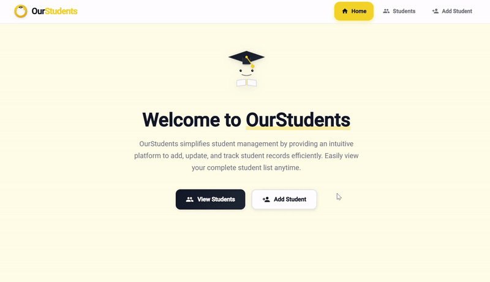

# Student Management System

A full-stack student management application built with **.NET 8** backend and **Angular 21** frontend.  
The project follows modern software architecture principles including **Domain-Driven Design (DDD)** and **CQRS pattern with MediatR**, and uses modern Angular features such as **signals** and **standalone components**.

---

## Demo

---

##  Features

- Create, read, update, and delete students (CRUD)
- Clean architecture with separated layers
- CQRS pattern using MediatR
- RESTful API with Swagger documentation
- Reactive frontend using Angular Signals
- Material UI design
- Interceptors and centralized API communication

---

##  Table of Contents

- Architecture Overview  
- Technology Stack    
- API Endpoints  

---

##  Architecture Overview

### Backend Architecture

- **Domain Layer**: Core business entities and interfaces  
- **Application Layer**: CQRS pattern with MediatR, validation, and mapping  
- **Infrastructure Layer**: Data persistence with EF Core and SQL Server  
- **API Layer**: RESTful endpoints with Swagger UI  

---

### Frontend Architecture

- **Standalone Components**: Modern Angular 21 architecture  
- **Signal-based State Management**: Reactive state with Angular Signals  
- **Material Design**: UI using Angular Material  
- **Service Layer**: Centralized API communication with interceptors  

---

##  Technology Stack

### Backend (.NET 8)

- Framework: .NET 8.0  
- Database: SQL Server with Entity Framework Core 8  
- Architecture: Domain-Driven Design (DDD)  
- Pattern: CQRS with MediatR  
- Validation: FluentValidation  
- Mapping: AutoMapper  
- API: RESTful with Swagger/OpenAPI  
- Middleware: Custom exception handling  

---

### Frontend (Angular 21)

- Framework: Angular 21  
- State Management: Angular Signals  
- UI Components: Angular Material  
- HTTP Client: RxJS with interceptors  
- Routing: Angular Router with lazy loading  
- Forms: Reactive Forms with validation  
- Animations: Angular Animations API  
- Date Handling: date-fns library  

---

